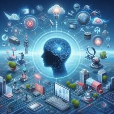

# <ins>Influencia de las IAs en el Aprendizaje Humano :robot: :books:<ins>

## :book: Descripción  
***Beneficios, riesgos y casos de uso de la IA***
> *“La IA no reemplazará a los maestros, pero los que la usen reemplazarán a los que no lo hagan.”*  

## :earth_africa: Impacto  
  | Emogi              | beneficio/riesgos         |
|--------------------| --- |
| :white_check_mark: | Personalización           |
| :white_check_mark: | Accesibilidad             |
| :warning:          | ~~Dependencia tecnológica~~ | 

[IA mas usada](https://chatgpt.com)

[funcions.py](funcions.py)